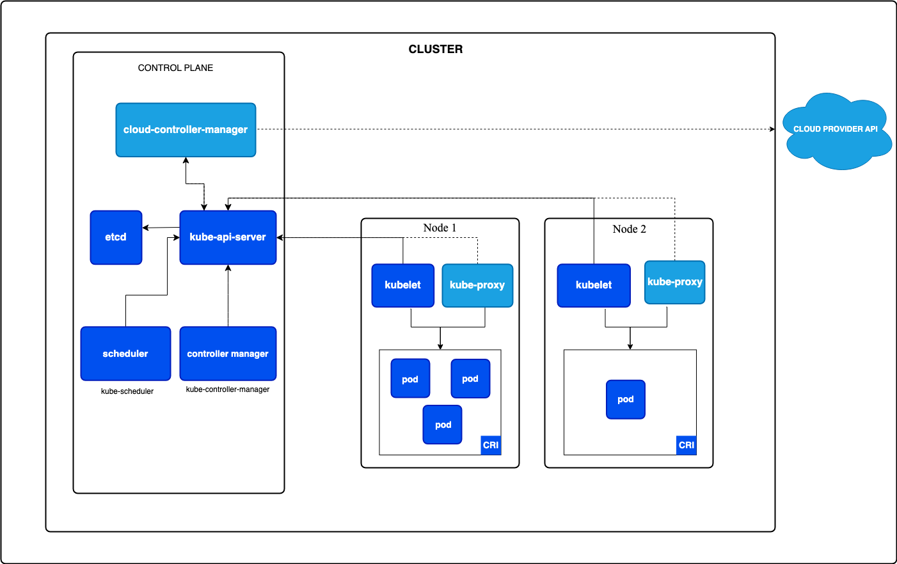

# **Kubernetes Components** 

Kubernetes has a **modular architecture** consisting of various components that work together to manage containers efficiently. These components are categorized into:
1. **Control Plane Components** (Manage the cluster)
2. **Node Components** (Run the workloads)

---



## **Control Plane Components (Master Node)**
The **control plane** manages the cluster and ensures the desired state of applications.

### **1. API Server (`kube-apiserver`)**
- The **entry point** for all Kubernetes commands (`kubectl`, `helm`, etc.).
- **Exposes Kubernetes API** for communication between components.
- **Handles authentication & authorization**.

**Example:**  
When you run:
```bash
kubectl get pods
```
The request is sent to the **API Server**, which retrieves pod details from **etcd**.

---

### **2. Etcd (Distributed Key-Value Store)**
- Stores **all cluster data** (configurations, states, etc.).
- Acts as **Kubernetes' database**.
- Highly available and **fault-tolerant**.

**Example:**
- When a new pod is created, its information is stored in `etcd`.
- If a node crashes, Kubernetes **restores state from etcd**.

---

### **3. Controller Manager (`kube-controller-manager`)**
- Manages **reconciliation loops** (ensures cluster matches the desired state).
- Runs multiple controllers:
    - **Node Controller**: Detects failed nodes.
    - **Replication Controller**: Ensures correct pod count.
    - **Service Controller**: Manages Service endpoints.

**Example:**  
If a pod crashes, the **Replication Controller** automatically starts a new one.

---

### **4. Scheduler (`kube-scheduler`)**
- Assigns **pods to nodes** based on:
    - CPU/memory availability.
    - Node affinity.
    - Taints & tolerations.

**Example:**  
When you deploy a pod, the scheduler checks available nodes and assigns it to the **best-suited node**.

---

## **Node Components (Worker Nodes)**
Each worker node runs containers and handles networking.

### **5. Kubelet**
- **Agent running on each worker node**.
- Talks to the **API Server** and manages containers.
- Ensures that the **desired state matches the actual state**.

**Example:**  
If a pod is scheduled on a node, the **kubelet pulls the image and starts the container**.

---

### **6. Kube Proxy**
- **Manages networking** between pods and services.
- Implements **load balancing** for services.

**Example:**  
If a request is made to a service, `kube-proxy` **routes it to an available pod**.

---

### **7. Container Runtime (Docker, containerd, CRI-O)**
- Runs and manages containers.
- Kubernetes **does not create containers directly**; it uses a runtime like:
    - **Docker**
    - **Containerd**
    - **CRI-O**

**Example:**  
When a pod is created, `kubelet` tells **containerd** to pull the image and run the container.

---

## **Additional Kubernetes Components**
### **8. Pod**
- The **smallest deployable unit** in Kubernetes.
- **Encapsulates** one or more containers.

**Example:**
```yaml
apiVersion: v1
kind: Pod
metadata:
  name: my-pod
spec:
  containers:
    - name: nginx
      image: nginx
```

---

### **9. Deployment**
- **Manages replicas of pods**.
- Ensures **zero downtime** updates.

**Example:**
```yaml
apiVersion: apps/v1
kind: Deployment
metadata:
  name: my-deployment
spec:
  replicas: 3
  selector:
    matchLabels:
      app: web
  template:
    metadata:
      labels:
        app: web
    spec:
      containers:
        - name: nginx
          image: nginx
```
**Kubernetes ensures 3 replicas are always running.** If one crashes, a new one is started.

---

### **10. Service**
- **Exposes** pods to other services or external users.
- Supports **Load Balancing**.

**Example:**
```yaml
apiVersion: v1
kind: Service
metadata:
  name: my-service
spec:
  selector:
    app: web
  ports:
    - protocol: TCP
      port: 80
      targetPort: 8080
  type: ClusterIP
```

---

## **Kubernetes Architecture Diagram**
```
                 Control Plane (Master Node)
-------------------------------------------------
| API Server  | etcd  | Scheduler  | Controllers |
-------------------------------------------------
                    ⬇
-------------------------------------------------
        Worker Nodes (Multiple Nodes)
-------------------------------------------------
| Kubelet | Kube Proxy | Container Runtime (Docker) |
-------------------------------------------------
|         Pods (Containers)                         |
-------------------------------------------------
```

---


